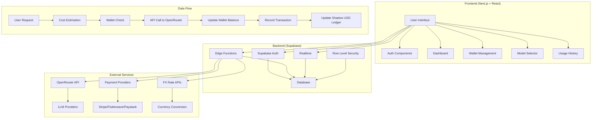
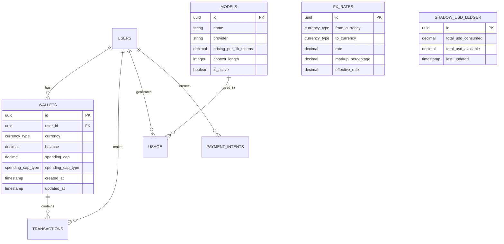
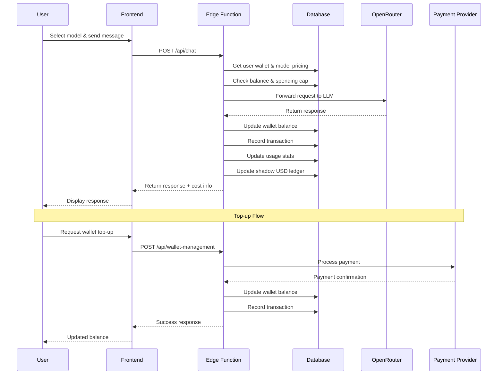
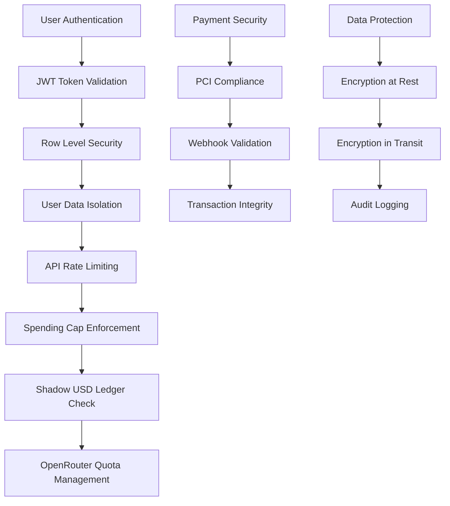
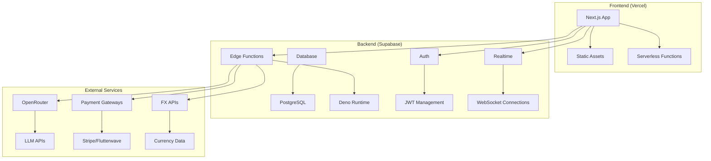

# Tuma System Architecture

## High-Level Architecture

## Database Schema

## API Flow

## Security Model

## Deployment Architecture

## Key Features Implementation

### 1. Multi-Currency Wallet System
- **Database**: Wallets table with currency support
- **FX Conversion**: Real-time rates with markup
- **Balance Management**: Atomic transactions with rollback

### 2. Post-Paid Model
- **Real-time Deduction**: Balance updated after each API call
- **Spending Caps**: User-defined limits enforced at API level
- **Cost Estimation**: Pre-call cost calculation

### 3. Shadow USD Ledger
- **Quota Management**: Track total USD consumption
- **OpenRouter Limits**: Prevent exceeding provider quotas
- **Reconciliation**: Compare with actual usage

### 4. Real-time Updates
- **Supabase Realtime**: Live wallet balance updates
- **WebSocket Connections**: Instant notifications
- **State Synchronization**: Frontend state management

### 5. Payment Integration
- **Multiple Providers**: Stripe, Flutterwave, Paystack
- **Webhook Handling**: Secure payment confirmation
- **Transaction Recording**: Complete audit trail

## Performance Considerations

- **Edge Functions**: Global distribution for low latency
- **Database Indexing**: Optimized queries for wallet operations
- **Caching**: FX rates and model pricing cached
- **Rate Limiting**: Prevent abuse and ensure fair usage
- **Connection Pooling**: Efficient database connections

## Monitoring & Observability

- **Supabase Dashboard**: Database and function monitoring
- **Error Tracking**: Comprehensive error logging
- **Usage Analytics**: Real-time usage metrics
- **Performance Metrics**: API response times
- **Alerting**: Automated alerts for critical issues
